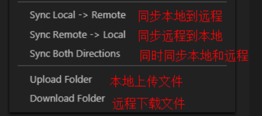

# centos 下安装 nginx

## 1.停止防火墙

```sh
systemctl stop firewald.service
```

## 2.安装依赖模块

```bash
yum -y install gcc gcc-c++ autoconf pcre pcre-devel make automake
yum -y install wget httpd-tools vim
```

## 3.安装 nginx

```sh
vi /etc/yum.repos.d/nginx.repo
```

```bash
[nginx]
name=nginx repo
baseurl=http://nginx.org/packages/centos/7/$basearch/
gpgcheck=0
enabled=1
```

```bash
yum install nginx -y
```

## 4.启动 nginx

```bash
systemctl start nginx.service
```

## 5.配置 sftp

- vscode 搜 sftp 插件安装
- f1 配置相关参数

```json
{
  "name": "20",
  "host": "【ip地址】",
  "protocol": "sftp",
  "port": 22,
  "username": "【服务器名称】",
  "password": "【服务器密码】",
  "remotePath": "/home/xx/web/webapp",
  "uploadOnSave": true,
  "ignore": ["**/.idea/**", "**/.vscode/**", "**/.git/**", "**/.DS_Store"],
  "watcher": {
    "files": "*",
    "autoUpload": false,
    "autoDelete": false
  }
}
```

- 右键需要上传的文件或文件夹



## 6.重启 nginx

```bash
systemctl restart nginx.service
```
