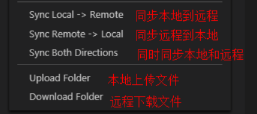

# 二.配置静态资源

::: tip 前言

- 静态资源：一般客户端发送请求到 web 服务器，web 服务器从内存中取到相应的文件，返回给客户端，客户端解析并渲染显示出来。
- 动态资源：一般客户端请求的动态资源，先将请求交于 web 容器，web 容器连接数据库，数据库处理数据之后，将内容交给 web 服务器，web 服务器返回给客户端解析渲染处理。

:::

| 类型       | 种类           |
| ---------- | -------------- |
| 浏览器渲染 | HTML、CSS、JS  |
| 图片       | JPEG、GIF、PNG |
| 视频       | FLV、MPEG      |
| 下载文件   | Word、Excel    |


## 1.服务端配置

- [安装 nginx](/base/build/1.config.html#_1-1-centos7-64-位)

## 2.客户端配置

- vscode 搜 sftp 插件安装
- vscode 中按 f1 配置相关参数

```json
{
  "name": "20",
  "host": "【ip地址】",
  "protocol": "sftp",
  "port": 22,
  "username": "【服务器名称】",
  "password": "【服务器密码】",
  "remotePath": "【服务器上静态资源存储地址】",
  "uploadOnSave": true,
  "ignore": ["**/.idea/**", "**/.vscode/**", "**/.git/**", "**/.DS_Store"],
  "watcher": {
    "files": "*",
    "autoUpload": false,
    "autoDelete": false
  }
}
```

- 打包前端项目到`dist`
- 右键需要上传的文件或文件夹


