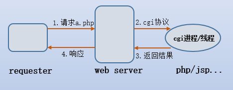

# 目录说明

| 目录名   | 描述                   |
| -------- | ---------------------- |
| app      | 存放代码和应用         |
| backup   | 存放备份的文件         |
| download | 下载下来的代码和安装包 |
| logs     | 放日志的               |
| work     | 工作目录               |

## 2.1 安装目录

查看 nginx 安装的配置文件和目录

```sh
rpm -ql nginx
```

## 2.2 日志切割文件

```sh
/etc/logrotate.d/nginx
```

- 对访问日志进行切割

```sh
/var/log/nginx/*.log{
    daily
}
```

```sh
ls /var/log/nginx/*.log
/var/log/nginx/access.log /var/log/nginx/error.log
```

## 2.3 主配置文件

| 路径                           | 用途                     |
| ------------------------------ | ------------------------ |
| /etc/nginx/nginx.conf          | 核心配置文件             |
| /etc/nginx/conf.d/default.conf | 默认 http 服务器配置文件 |

## 2.4 cgi 配置

- CGI 是 common gateway interface(通用网关接口)
- Web Server 通过 cgi 协议可以把动态的请求传递给如 php、jsp、python 和 perl 等应用程式。
- FastCGI 实际是增加了一些扩展功能的 CGI，是 CGI 的改进，描述了客户端和 Web 服务器程序之间传输数据的一种标准。
- SCGI 协议是一个 CGI（通用网关接口） 协议的替代品，它是一个应用与 HTTP 服务器的接口标准，类似于 FastCGI，但是它设计得更为容易实现。
- uwsgi 是一个 Web 服务器，它实现了 WSGI 协议、uwsgi、http 等协议。

  

| 路径                      | 用途         |
| ------------------------- | ------------ |
| /etc/nginx/fastcgi_params | fastcgi 配置 |
| /etc/nginx/scgi_params    | scgi 配置    |
| /etc/nginx/uwsgi_params   | uwsgi 配置   |

## 2.5 编码转换映射转化文件

- 这三个文件都是与编码转换映射文件，用于在输出内容到客户端是，将一种编码转换到另一种编码
- `koi8-r`是斯拉夫文字 8 位元编码，供俄语及保加利亚语使用。在 Unicode 未流行之前，KOI8-R 是最为广泛使用的俄语编码，使用率甚至比 ISO/IEC 8859-5 还高。这 3 个文件存在是因为作者是俄国人的原因。

| 路径               | 用途                   |
| ------------------ | ---------------------- |
| /etc/nginx/koi-utf | koi8-r<-->utf-8        |
| /etc/nginx/koi-win | koi8-r<-->windows-1251 |
| /etc/nginx/win-utf | windows-125<-->utf-8   |

## 2.6 扩展文件

/etc/nginx/mime.types

| 路径     | 用途                                                                    |
| -------- | ----------------------------------------------------------------------- |
| 配置文件 | /etc/nginx/mime.types // 设置 http 协议的 Content-Type 与扩展名对应关系 |

## 2.7 守护进程管理

| 用于配置系统守护进程管理方式路径            | 用途 |
| ------------------------------------------- | ---- |
| /usr/lib/systemd/system/nginx-debug.service | --   |
| /usr/lib/systemd/system/nginx.service       | ---  |
| /etc/sysconfig/nginx                        | --   |
| /etc/sysconfig/nginx-debug                  | ---  |

```bash
systemctl restart nginx.service
```

## 2.8nginx 模块目录

- nginx 安装的模块

| 路径               | 用途                     |
| ------------------ | ------------------------ |
| /etc/nginx/modules | 最基本的共享库和内核模块 |

目的是存放用于启动系统和执行 root 文件系统的命令，如`/bin`和`/sbin`的二进制文件的共享库，或者存放 32 位，或者 64 位（file 命令查看）||/usr/lib64/nginx/modules|64 位共享库

## 2.9 文档

- nginx 的手册和帮助文件

| 路径                                  | 用途     |
| ------------------------------------- | -------- |
| /usr/share/doc/nginx-1.14.2           | 帮助文档 |
| /usr/share/doc/nginx-1.14.0/COPYRIGHT | 版权声明 |
| /usr/share/man/man8/nginx.8.gz        | 手册     |

## 2.10 缓存目录

| 路径             | 用途             |
| ---------------- | ---------------- |
| /var/cache/nginx | nginx 的缓存目录 |

## 2.11 日志目录

| 路径           | 用途             |
| -------------- | ---------------- |
| /var/log/nginx | nginx 的日志目录 |

## 2.12 可执行命令

- nginx 服务的启动管理的可执行文件

| 路径                  | 用途               |
| --------------------- | ------------------ |
| /usr/sbin/nignx       | 可执行命令         |
| /usr/sbin/nginx-debug | 调试执行科执行命令 |


